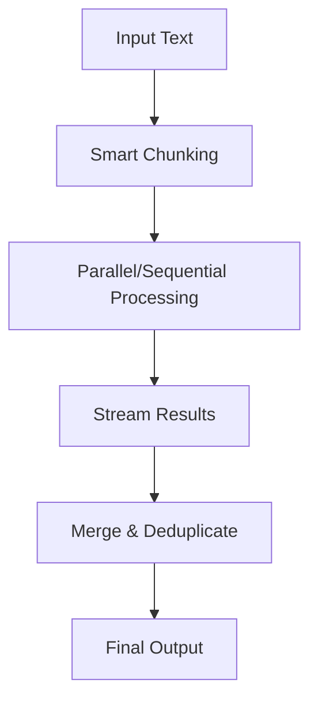

# @aid-on/fractop

[](https://www.npmjs.com/package/@aid-on/fractop)
[](https://opensource.org/licenses/MIT)
[](https://www.typescriptlang.org/)

[日本語](./README.ja.md) | English

FractoP (Fractal Processor) - Elegant text processing for LLMs with streaming, batching, and fractal chunking.

## 🚨 The Problem

**LLMs have context limits.** GPT-4 caps at 128K tokens. Claude at 200K. Even Gemini's 2M context fills up fast.

What happens when you need to:
- Summarize a 500-page PDF?
- Analyze a codebase with 10,000 files?
- Translate an entire book?
- Process millions of customer reviews?

```typescript
// ❌ This fails
const summary = await llm.process(entire500PagePDF);
// Error: Context length exceeded (400,000 tokens > 128,000 limit)
```

## ✅ The Solution: FractoP

FractoP intelligently chunks your text, processes each piece, and merges results - all while preserving context.

```typescript
// ✅ This works for ANY size document
const summary = await fractop()
  .withLLM(llm)
  .chunking({ size: 3000, overlap: 300 })
  .parallel(5)
  .run(entire500PagePDF);
```

## ✨ Features

- **🎯 Fluent API**: Elegant chainable interface for building processing pipelines
- **🌊 Nagare Streaming**: Reactive stream processing with `Stream<T>` integration
- **🔄 Smart Chunking**: Intelligent text splitting with overlap for context preservation
- **⚡ Parallel Processing**: Concurrent chunk processing for maximum performance
- **🛡️ Enterprise Reliability**: Timeouts, retries, and circuit breaker patterns built-in
- **🎨 UnillM Integration**: Works seamlessly with any LLM through UnillM adapters
- **📦 Batch Processing**: Process multiple documents efficiently
- **🔁 Auto-retry**: Exponential backoff for transient failures

## Installation

```bash
npm install @aid-on/fractop
```

## 🚀 Quick Start

### Primary Interface - Fluent API

The most elegant way to use FractoP:

```typescript
import { fractop } from '@aid-on/fractop';

// Simple and elegant
const results = await fractop()
  .withLLM(async (chunk) => {
    // Your LLM logic here
    const response = await callYourLLM(chunk);
    return response;
  })
  .chunking({ size: 3000, overlap: 300 })
  .parallel(5)
  .retry(3, 1000)
  .timeout(30000)
  .run(longText);
```

### With GROQ/OpenAI

```typescript
const summaries = await fractop()
  .withLLM(async (chunk) => {
    const response = await fetch('https://api.groq.com/openai/v1/chat/completions', {
      method: 'POST',
      headers: {
        'Authorization': `Bearer ${GROQ_API_KEY}`,
        'Content-Type': 'application/json'
      },
      body: JSON.stringify({
        model: 'llama-3.1-8b-instant',
        messages: [
          { role: 'system', content: 'Summarize concisely.' },
          { role: 'user', content: chunk }
        ]
      })
    });
    const data = await response.json();
    return data.choices[0].message.content;
  })
  .chunking({ size: 2000, overlap: 200 })
  .run(document);
```

### With UnillM

```typescript
// UnillM configuration object
const results = await fractop()
  .withLLM({
    model: 'groq:llama-3.1-70b',
    credentials: { groqApiKey: process.env.GROQ_API_KEY },
    messages: (chunk) => [
      { role: 'system', content: 'Extract key points.' },
      { role: 'user', content: chunk }
    ],
    options: { temperature: 0.7 }
  })
  .chunking({ size: 3000 })
  .parallel(3)
  .run(text);

// Or with custom transform
const entities = await fractop<Entity[]>()
  .withLLM({
    model: 'anthropic:claude-3-5-haiku',
    credentials: { anthropicApiKey: process.env.ANTHROPIC_API_KEY },
    messages: (chunk) => [
      { role: 'system', content: 'Extract entities as JSON.' },
      { role: 'user', content: chunk }
    ],
    transform: (response) => JSON.parse(response.text)
  })
  .run(document);
```

## 🌊 Streaming with Nagare

Process large documents with memory-efficient streaming:

```typescript
import { fractopStream } from '@aid-on/fractop';

// Stream results as they're processed
const stream = fractopStream(largeDocument)
  .withLLM(async (chunk) => await processChunk(chunk))
  .chunking({ size: 2000, overlap: 200 })
  .parallel(3)
  .stream();

// Reactive stream operations
await stream
  .map(result => result.toUpperCase())
  .filter(result => result.length > 100)
  .take(10)
  .collect();
```

### Batch Processing

Process multiple documents efficiently:

```typescript
import { fractopBatch } from '@aid-on/fractop';

const documents = ['doc1.txt', 'doc2.txt', 'doc3.txt'];

const results = await fractopBatch(documents)
  .withLLM(async (chunk) => await summarize(chunk))
  .chunking({ size: 2000 })
  .collectAll();

// Results is a Map<string, T[]>
for (const [doc, summaries] of results) {
  console.log(`${doc}: ${summaries.length} chunks processed`);
}
```

## 🔧 Advanced Features

### Custom Processing Pipeline

```typescript
const pipeline = await fractop<ExtractedEntity>()
  .withLLM(llmProcessor)
  .chunking({ size: 4000, overlap: 400 })
  .parallel(5)
  .retry(3, 2000)
  .timeout(60000, true)  // per-chunk timeout
  .minResults(50)
  .merge('simple')  // or provide custom merger
  .run(text);
```

### Context-Aware Processing

```typescript
const results = await fractop()
  .withLLM(llmProcessor)
  .context(async (text) => {
    // Generate global context from full document
    return await generateSummary(text.substring(0, 5000));
  })
  .process(async (chunk, context) => {
    // Process each chunk with context
    return await extractWithContext(chunk, context);
  })
  .merge((results) => customMergeLogic(results))
  .run(document);
```

### Stream Processing

Process documents as reactive streams:

```typescript
// Stream individual results
const stream = fractopStream(document)
  .withLLM(async (chunk) => await analyze(chunk))
  .chunking({ size: 2000, overlap: 200 })
  .stream();

// Use Nagare's reactive operators
const processed = await stream
  .map(result => transform(result))
  .filter(result => result.score > 0.8)
  .collect();
```

## 🏗️ Architecture

FractoP's fractal architecture enables processing of unlimited document sizes:



### Key Concepts

1. **Fractal Chunking**: Intelligent text splitting that preserves context
2. **Stream Processing**: Memory-efficient processing with Nagare streams
3. **Context Propagation**: Maintains document understanding across chunks
4. **Result Merging**: Smart deduplication and aggregation

## 📊 Performance

```typescript
// Optimize for speed
const fast = await fractop()
  .withLLM(llm)
  .chunking({ size: 5000 })  // Larger chunks
  .parallel(10)               // High concurrency
  .run(text);

// Optimize for quality
const quality = await fractop()
  .withLLM(llm)
  .chunking({ size: 2000, overlap: 500 })  // More overlap
  .retry(5, 2000)                          // More retries
  .timeout(120000)                         // Longer timeout
  .run(text);
```

## 🛡️ Reliability Features

### Automatic Retries
```typescript
fractop()
  .withLLM(llm)
  .retry(3, 1000)  // 3 retries with exponential backoff
  .run(text);
```

### Timeouts
```typescript
fractop()
  .withLLM(llm)
  .timeout(60000)        // Overall timeout
  .timeout(5000, true)   // Per-chunk timeout
  .run(text);
```

### Circuit Breaker
Automatically stops processing after consecutive failures to prevent cascade failures.

## 💡 Real-World Examples

### 📚 Summarize a 500-Page Research Paper

```typescript
const paper = readFileSync('quantum-computing-thesis.pdf', 'utf-8');
// 200,000+ characters - would fail with direct LLM call

const summary = await fractop()
  .withLLM({
    model: 'groq:llama-3.1-70b',
    credentials: { groqApiKey: process.env.GROQ_API_KEY },
    messages: (chunk) => [
      { role: 'system', content: 'Summarize key findings. Be concise.' },
      { role: 'user', content: chunk }
    ]
  })
  .chunking({ size: 3000, overlap: 300 })
  .parallel(5)  // Process 5 chunks simultaneously
  .run(paper);

// Merge summaries into final document
const finalSummary = summary.join('\n\n');
```

### 🔍 Analyze 1000+ Files in a Codebase

```typescript
const files = globSync('src/**/*.ts');  // 1000+ TypeScript files
const fullCode = files.map(f => readFileSync(f)).join('\n');
// Millions of characters - impossible with single LLM call

// Extract all API endpoints
const endpoints = await fractop()
  .withLLM({
    model: 'anthropic:claude-3-5-haiku',
    credentials: { anthropicApiKey: API_KEY },
    messages: (chunk) => [
      { role: 'system', content: 'Extract REST API endpoints as JSON.' },
      { role: 'user', content: chunk }
    ],
    transform: (res) => JSON.parse(res.text)
  })
  .chunking({ size: 4000, overlap: 500 })  // Overlap prevents missing endpoints
  .parallel(10)  // Analyze 10 files simultaneously
  .run(fullCode);

// Deduplicate results
const uniqueEndpoints = [...new Set(endpoints.flat())];
console.log(`Found ${uniqueEndpoints.length} API endpoints`);
```

### 🌐 Translate an Entire Book

```typescript
const book = await fetch('https://gutenberg.org/files/2600/2600-0.txt')
  .then(r => r.text());  // War and Peace - 3.2 million characters!

const translatedBook = await fractop()
  .withLLM({
    model: 'gemini:gemini-2.5-pro',
    credentials: { geminiApiKey: process.env.GEMINI_API_KEY },
    messages: (chunk) => [
      { role: 'system', content: 'Translate to Japanese. Keep literary style.' },
      { role: 'user', content: chunk }
    ]
  })
  .chunking({ 
    size: 2000,      // Smaller chunks for quality
    overlap: 200     // Preserve sentence flow
  })
  .retry(3, 2000)    // Retry failed chunks
  .timeout(120000)   // 2 min timeout per chunk
  .run(book);

writeFileSync('war-and-peace-ja.txt', translatedBook.join(''));
```

### 📊 Process 50,000 Customer Reviews

```typescript
// 50,000 support tickets from database
const tickets = await db.query('SELECT * FROM tickets LIMIT 50000');
const ticketTexts = tickets.map(t => t.content);

// Process in batches with streaming
const analysis = await fractopBatch(ticketTexts)
  .withLLM({
    model: 'groq:llama-3.1-8b-instant',  // Fast model for high volume
    credentials: { groqApiKey: API_KEY },
    messages: (ticket) => [
      { role: 'system', content: 'Output: sentiment|category|priority' },
      { role: 'user', content: ticket }
    ],
    transform: (res) => {
      const [sentiment, category, priority] = res.text.split('|');
      return { sentiment, category, priority };
    }
  })
  .collectAll();

// Aggregate insights
const insights = {
  sentiments: { positive: 0, negative: 0, neutral: 0 },
  categories: new Map(),
  highPriority: []
};

for (const [ticket, results] of analysis) {
  results.forEach(r => {
    insights.sentiments[r.sentiment]++;
    if (r.priority === 'high') insights.highPriority.push(ticket);
  });
}
```

### 🤖 Generate Tests for Large Components

```typescript
const component = readFileSync('src/Dashboard.tsx', 'utf-8');
// 5000-line React component

const tests = await fractop()
  .withLLM({
    model: 'openai:gpt-4o',
    credentials: { openaiApiKey: process.env.OPENAI_API_KEY },
    messages: (chunk) => [
      { role: 'system', content: 'Generate Jest unit tests with React Testing Library.' },
      { role: 'user', content: chunk }
    ]
  })
  .chunking({ size: 1500 })  // Each chunk gets targeted tests
  .parallel(3)
  .run(component);

// Combine into test suite
const testFile = `
describe('Dashboard Component', () => {
  ${tests.join('\n\n')}
});
`;
writeFileSync('Dashboard.test.tsx', testFile);
```

### 💬 Real-time Document Q&A

```typescript
async function askDocument(doc: string, question: string) {
  // Stream through document to find answers
  return await fractopStream(doc)
    .withLLM({
      model: 'gemini:gemini-2.5-flash',  // Fast for real-time
      credentials: { geminiApiKey: API_KEY },
      messages: (chunk) => [
        { role: 'user', content: `Answer "${question}" from: ${chunk}` }
      ]
    })
    .chunking({ size: 3000, overlap: 500 })
    .stream()
    .filter(answer => answer.length > 20)  // Filter relevant answers
    .take(3)  // First 3 good answers
    .collect();
}

// Usage
const manual = readFileSync('kubernetes-manual.txt', 'utf-8');
const answers = await askDocument(manual, "How to set up auto-scaling?");
// Returns in seconds, not minutes!
```

## 🎯 Common Use Cases

### Document Summarization
```typescript
const summary = await fractop()
  .withLLM(async (chunk) => await summarize(chunk))
  .chunking({ size: 3000, overlap: 300 })
  .merge(results => results.join('\n'))
  .run(document);
```

### Keyword Extraction
```typescript
const keywords = await fractop<string[]>()
  .withLLM(async (chunk) => await extractKeywords(chunk))
  .chunking({ size: 2000 })
  .merge(results => [...new Set(results.flat())])
  .run(document);
```

### Translation
```typescript
const translated = await fractop()
  .withLLM(async (chunk) => await translate(chunk, 'ja'))
  .chunking({ size: 2000, overlap: 200 })
  .run(document);
```

### Question Answering
```typescript
const answers = await fractop()
  .withLLM(async (chunk) => await answerQuestion(chunk, question))
  .chunking({ size: 3000 })
  .parallel(5)
  .run(document);
```

## ⚙️ Configuration

### Default Settings

```typescript
{
  chunkSize: 3000,        // Optimized for LLM token limits
  overlapSize: 300,       // Context preservation
  concurrency: 3,         // Parallel processing threads
  maxRetries: 2,          // Retry attempts
  retryDelay: 1000,       // Initial retry delay (ms)
  chunkTimeout: 30000     // Per-chunk timeout (ms)
}
```

### Advanced Configuration

```typescript
const processor = fractop()
  .withLLM(llm)
  .chunking({ 
    size: 4000,      // Larger chunks for better context
    overlap: 500     // More overlap for continuity
  })
  .parallel(5)       // 5 concurrent processors
  .retry(3, 2000)    // 3 retries, 2s initial delay
  .timeout(60000)    // 1 minute overall timeout
  .minResults(100)   // Minimum 100 results
  .build();
```

## 📦 API Reference

### Main Exports

```typescript
// Primary fluent interface
import { fractop } from '@aid-on/fractop';

// Streaming interfaces
import { fractopStream, fractopBatch } from '@aid-on/fractop';

// Core processor (advanced use)
import { FractalProcessor } from '@aid-on/fractop';

// Utilities
import { simpleMerge, weightedMerge } from '@aid-on/fractop';
```

### Fluent API Methods

| Method | Description |
|--------|-------------|
| `.withLLM(fn\|config)` | Set LLM processor (function or UnillM config) |
| `.chunking(opts)` | Configure chunk size and overlap |
| `.parallel(n)` | Enable parallel processing |
| `.retry(n, delay)` | Configure retry behavior |
| `.timeout(ms, perChunk?)` | Set timeout limits |
| `.context(fn)` | Set context generator |
| `.process(fn)` | Set chunk processor |
| `.merge(strategy)` | Set merge strategy |
| `.minResults(n)` | Set minimum result count |
| `.run(text)` | Execute processing |

## 🔬 TypeScript

Full TypeScript support with generics:

```typescript
interface Analysis {
  sentiment: 'positive' | 'negative' | 'neutral';
  score: number;
  keywords: string[];
}

const results = await fractop<Analysis>()
  .withLLM(async (chunk): Promise<Analysis> => {
    // Type-safe processing
    return analyzeChunk(chunk);
  })
  .merge((results: Analysis[][]) => {
    // Type-safe merging
    return combineAnalyses(results);
  })
  .run(document);

// results is Analysis[]
```

## 🚀 Performance Tips

1. **Chunk Size**: Balance between context and token limits (2000-4000 chars recommended)
2. **Overlap**: 10-20% of chunk size for good context preservation
3. **Concurrency**: Match your LLM rate limits (3-5 for most providers)
4. **Streaming**: Use `fractopStream` for documents > 100KB
5. **Batching**: Use `fractopBatch` for multiple documents

## License

MIT